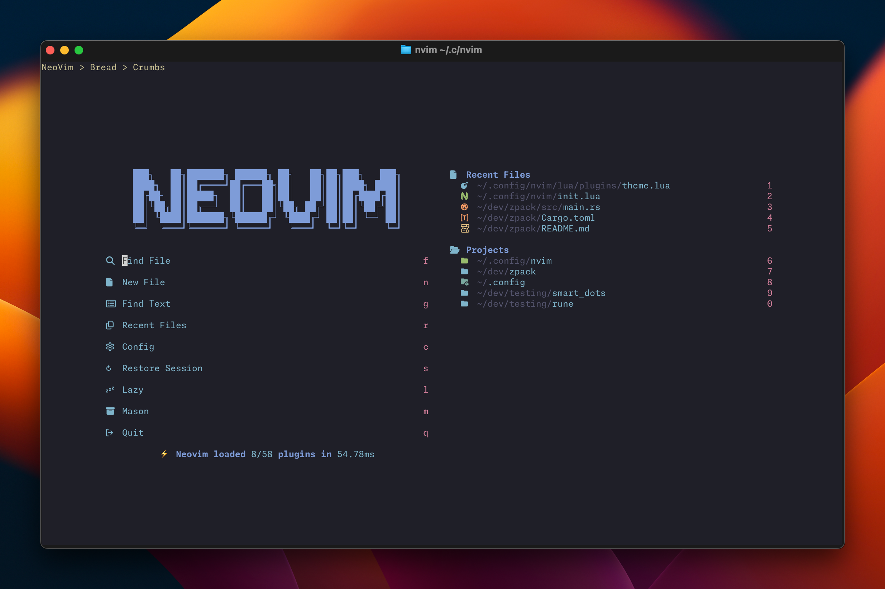
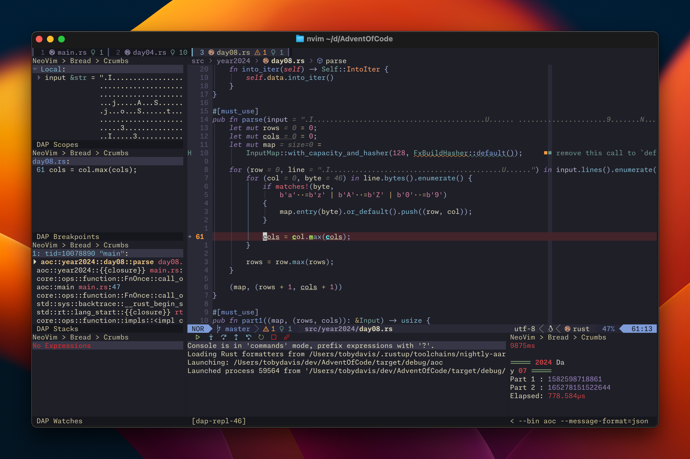

# Neovim Configuration





## Introduction

This is my Neovim configuration, containing a collection of useful plugins,
keybinds and settings.

### Screenshots

For more screenshots of the configuration, please refer to [the `images`
directory](https://github.com/Pencilcaseman/nvim-config/tree/master/images)

## Installation

### Install Neovim

This configuration targets *only* the
<!-- ['stable'](https://github.com/neovim/neovim/releases/tag/stable) and latest -->
['nightly'](https://github.com/neovim/neovim/releases/tag/nightly) build of Neovim.
If you are experiencing issues, please make sure you have the latest version. No
attempts are made to maintain backwards compatibility with older Neovim
versions.

### Install External Dependencies

External Requirements:
- Basic utils: `git`, `make`, `unzip`, C Compiler (`gcc`)
- [ripgrep](https://github.com/BurntSushi/ripgrep#installation)
- Clipboard tool (`xclip`/`xsel`/`win32yank` or other depending on platform)
- A [Nerd Font](https://www.nerdfonts.com/): optional, provides various icons
  - if you have it set `vim.g.have_nerd_font` in `init.lua` to true
- Language Setup:
  - If you want to write Typescript, you need `npm`
  - If you want to write Golang, you will need `go`
  - If you want to write Rust, you will need `cargo`
  - etc.

> **NOTE**
> Some plugins require additional dependencies to function. A (mostly complete?)
> list can be found at
> [Additional Dependencies by Plugin](#additional-dependencies-by-plugin)

### Install this Configuration

> **NOTE**
> [Backup](#FAQ) your previous configuration (if any exists)

Neovim's configurations are located under the following paths, depending on your
OS:

| OS | PATH |
| :- | :--- |
| Linux, MacOS | `$XDG_CONFIG_HOME/nvim`, `~/.config/nvim` |
| Windows (cmd)| `%localappdata%\nvim\` |
| Windows (powershell)| `$env:LOCALAPPDATA\nvim\` |

#### Recommended Step

[Fork](https://docs.github.com/en/get-started/quickstart/fork-a-repo) this repo
so that you have your own copy that you can modify, then install by cloning the
fork to your machine using one of the commands below, depending on your OS.

> **NOTE**
> Your fork's url will be something like this:
> `https://github.com/<your_github_username>/nvim-config.git`

#### Clone the Configuration
> **NOTE**
> If following the recommended step above (i.e., forking the repo), replace
> `Pencilcaseman` with `<your_github_username>` in the commands below

<details><summary> Linux and Mac </summary>

```sh
git clone https://github.com/Pencilcaseman/nvim-config.git "${XDG_CONFIG_HOME:-$HOME/.config}"/nvim
```

</details>

<details><summary> Windows </summary>

If you're using `cmd.exe`:

```
git clone https://github.com/Pencilcaseman/nvim-config.git "%localappdata%\nvim"
```

If you're using `powershell.exe`

```
git clone https://github.com/Pencilcaseman/nvim-config.git "${env:LOCALAPPDATA}\nvim"
```

</details>

### Post Installation

Start Neovim

```sh
nvim
```

That's it! The plugins will automatically download and configure themselves,
which may take a few minutes depending on your machine. This only happens the
first time you use the configuration -- `nvim` will start (almost) instantly
from then on.

### FAQ

- What if I already have a Neovim configuration installed?
  - You should back up your existing configuration to make sure you can roll
    back if necessary.
  - The easiest way to do this is as follows:

    ```sh
    mv ~/.local/share/nvim{,.bak}
    mv ~/.local/state/nvim{,.bak}
    mv ~/.cache/nvim{,.bak}
    mv ~/.local/share/nvim/mason{,.bak}
    mv ~/.cache/nvim/mason{,.bak}
    ```

- Can I keep my existing configuration in parallel to this configuration?
  - Yes! You can use [NVIM_APPNAME](https://neovim.io/doc/user/starting.html#%24NVIM_APPNAME)`=nvim-NAME`
    to maintain multiple configurations. For example, you can install this
    configuration in `~/.config/nvim-pencilcaseman` and create an alias:

    ```sh
    alias nvim-pencilcaseman='NVIM_APPNAME="nvim-pencilcaseman" nvim'
    ```

    When you run Neovim using `nvim-pencilcaseman` alias it will use the
    alternative config directory and the matching local directory
    `~/.local/share/nvim-pencilcaseman`. You can apply this approach to any
    Neovim distribution that you would like to try out.
- What if I want to "uninstall" this configuration:
  - See the above section on having an existing configuration. Removing those
    directories will remove this configuration (be careful not to remove the
    backup!)

## Additional Dependencies by Plugin

### Typst-Preview

Typst is a modern typesetting language, akin to LaTeX. Typst supports live,
realtime rendering of your document via the Typst-Preview plugin. Type
`:TypstPreview` to get started.

#### Dependencies

- [`typst`](https://typst.app/)

### VimTex

VimTex provides LaTeX integrations into Neovim.

#### Dependencies

- [`LaTeX`](https://www.tug.org/texlive/)
